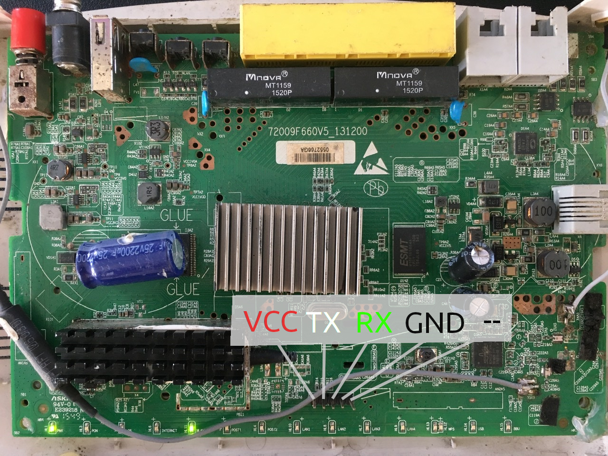

# Modem Indihome ZTE F609

Target:

- [ ] Rooting

## UART



UART Login: user root, pass root
TELNET Login: user root, pass: Telkom135
WEB  Login: user admin, pass Telkomdso123

[Boot.log](boot.log)

## Information

```
Base: 4.14_03ZTE2
CFE version 5.2.10-117.134 for BCM96838 (32bit,SP,BE)
Build Date: Wed, 29 Mar 2017 04:00:11 +0800 (root@BUILD.MDU)
Copyright (C) 2000-2013 Broadcom Corporation.
Broadcom BMIPS4350
```

``` bash
# cat /proc/cmdline 
ubi.mtd=8 root=ubi:rootfs_ubifs ro rootfstype=ubifs  irqaffinity=0

#cat /proc/mtd 
dev:    size   erasesize  name
mtd0:  07f00000 00020000 "whole flash"
mtd1:  00020000 00020000 "nvram"
mtd2:  01900000 00020000 "rootfs1"
mtd3:  01900000 00020000 "rootfs2"
mtd4:  00400000 00020000 "parameter tags"
mtd5:  00800000 00020000 "usercfg"
mtd6:  00400000 00020000 "middle ware"
mtd7:  00100000 00020000 "others"
mtd8:  01680000 00020000 "ubifs"
mtd9:  00280000 00020000 "spare_bootfs"
mtd10: 01512000 0001f000 "rootfs_ubifs"   --> Main RootFS (init start here)

# cat /proc/mounts 
rootfs / rootfs rw 0 0
ubi:rootfs_ubifs / ubifs ro,relatime 0 0
proc /proc proc rw,relatime 0 0
sysfs /sys sysfs rw,relatime 0 0
devpts /dev/pts devpts rw,relatime,mode=600,ptmxmode=000 0 0
/dev/mtdblock7 /data jffs2 rw,relatime 0 0
/dev/mtdblock4 /tagparam jffs2 rw,relatime 0 0
tmpfs /var tmpfs rw,relatime,size=15360k 0 0
/dev/mtdblock5 /userconfig jffs2 rw,relatime 0 0
none /mnt ramfs rw,noatime,nodiratime 0 0
none /proc/bus/usb usbfs rw,relatime 0 0

# cat /proc/cpuinfo 
system type             : 968380FGGU
processor               : 0
cpu model               : Broadcom BMIPS4350 V8.0
BogoMIPS                : 397.31
wait instruction        : yes
microsecond timers      : yes
tlb_entries             : 32
extra interrupt vector  : no
hardware watchpoint     : no
ASEs implemented        :
shadow register sets    : 1
kscratch registers      : 0
core                    : 0
VCED exceptions         : not available
VCEI exceptions         : not available

processor               : 1
cpu model               : Broadcom BMIPS4350 V8.0
BogoMIPS                : 409.60
wait instruction        : yes
microsecond timers      : yes
tlb_entries             : 32
extra interrupt vector  : no
hardware watchpoint     : no
ASEs implemented        :
shadow register sets    : 1
kscratch registers      : 0
core                    : 0
VCED exceptions         : not available
VCEI exceptions         : not available

```